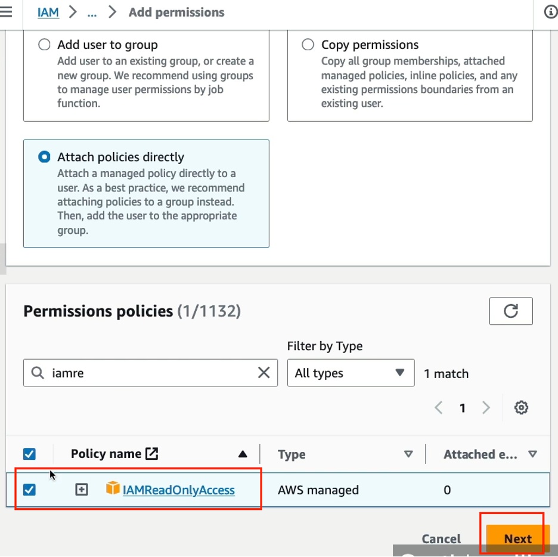
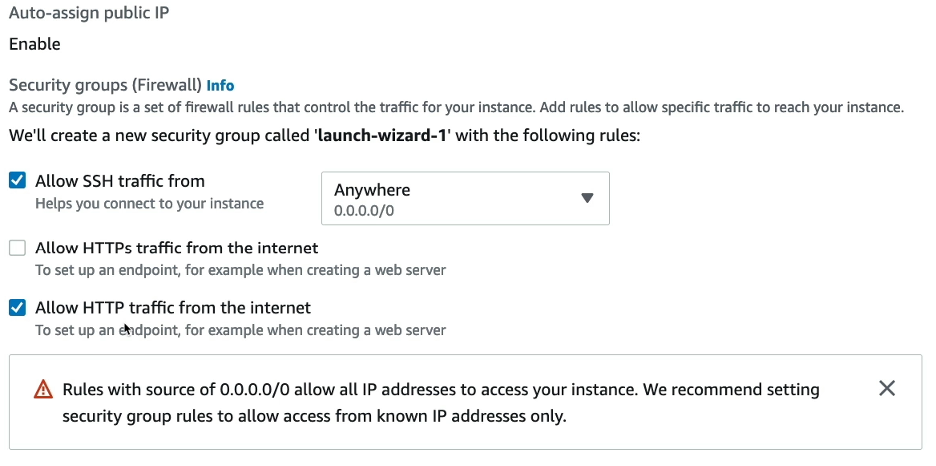
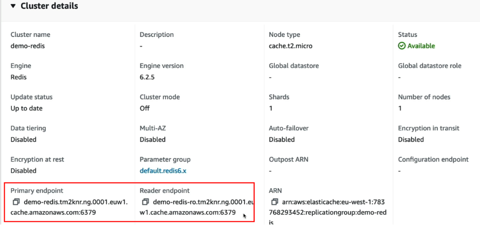
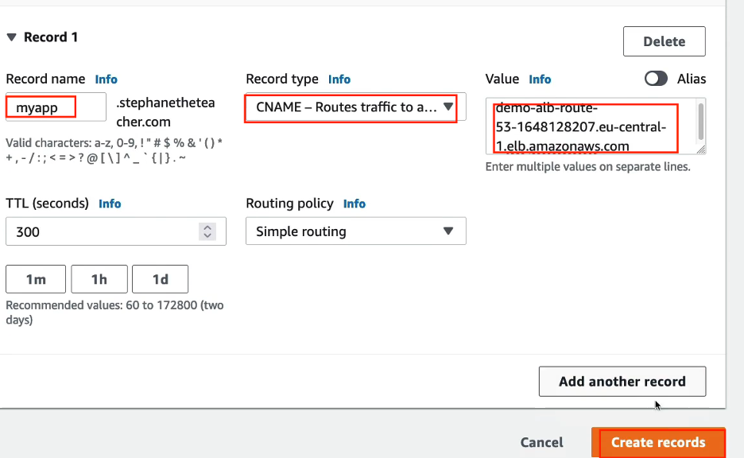

 # AWS-stephan-labs

## lab 01 Iam user and groups

- IAM => users

- put the username and confirm pass

- put the name and attached policy

- add user to group

- git him permission

- to create alias


- should be like this 


## lab 02 IAM policies

- the left pic is root account and right pic is user that you ceated

- if you delete the permissions

- to add permission

- add read only access


- here you just read only

- if you try to creat any thing you will got this error

- create a group name developers

- add the user stephan to it

- to create a policy

- press to this policy

- this mean that allow any action to any resource

- this is another one

- to create your own policy

- you can create it as json or visual

- this visual


- this is the output for the created policy


## lab 03 MFA

- if you want to change password policy


- to enable MFA


## lab 04 Access and secret access key 

- IAM => users => name of the user


## lab 05 IAM roles and attach it to ec2

- create role and select aws service 

- choose ec2

- choose readonly 


- to use the role create ec2 first

- attach the role to ec2

- test it by using aws iam lust-uers


## lab 05 IAM Security tools (credential report and access advisor)

- IAM => credential report


- IAM => user => access advisor


## lab 06 billing and cost management and budget 

- from billing and cost managment => cost explorer

- to can see bills you should make it from root account then activate IAM acess to make normal users see bills 


- create budget 


## lab 07 launch ec2 linux

- create ec2

- choose linux




```bash
#!/bin/bash
# Use this for your user data (script from top to bottom)
# install httpd (Linux 2 version)
yum update -y
yum install -y httpd
systemctl start httpd
systemctl enable httpd
echo "<h1>Hello World from $(hostname -f)</h1>" > /var/www/html/index.html
```


## lab 08 security group

- configure the inbound 


## lab 09 ec2 with role


## lab 10 ec2 launch types


## lab 11 placement group


## lab 12 placement group
- create two ec2s

- network interfaces for both


## lab 13 ec2 Hibernate 

- only these tupes support hibernate

- when creating ec2 choose this

- here to hibernate instance


## lab 14 EBS creation and attachment 

- note that the ec2 and ebs should be in same az
- here the eb2 which is attached to ec2


- create another ebs

- create it in another zone


- note it is available

- to attach it 


- note the instance has two ebs

- create third volume in another zone


- tried to attach but there is no ec2 in this zone

- when delete the ec2 , the main one is checked on delete on termination


## lab 15 EBS snapshots

- to creat snapshot from EBS , select it and create snapshot


- here the created snapshot

- you copy this snapshot to other region and then create ebs from this snapshot


- here you can create ebs from snpshot 

- here you can move it to other az 


- here the recycle bin 

- create retention role and this mean how much time should be kept before permenant deletion 


- tried to delete the snapshot

- will appear at the recycle bin

- you can recover it 


## lab 16 AMI

- create ec2 with this script
```bash
#!/bin/bash
# Use this for your user data (script from top to bottom)
# install httpd (Linux 2 version)
yum update -y
yum install -y httpd
systemctl start httpd
systemctl enable httpd
echo "<h1>Hello World from $(hostname -f)</h1>" > /var/www/html/index.html
```

- create an image from ec2


- from here you will find AMIs

- create ec2 from this AMI

- put this script
```bash
#!/bin/bash
# Use this for your user data (script from top to bottom)
# install httpd (Linux 2 version)

echo "<h1>Hello World from $(hostname -f)</h1>" > /var/www/html/index.html
```

- test it


## lab 17 EBS encryption 


## lab 18 EFS

- create EFS

- customize it 

- choose lifecycle managment

- choose performance setting


- network setting 


- create ec2 and when creating choose the EFS 

- create another ec2 in other az

- login to each ec2  and mount the efs 


## lab 19 App load balancer part 01

- creat 2 EC2s with this script

- create app load balancer


- name of load balancer

- choose three zones

- create a sec group for load balancer

- creat inbound rule and means that any one can reach the load balancer


- choose the sec group

- create a target group


- name of target group and which protocol the EC2s are listening on 

- choose which EC2s to be member in target group


- create listener and choose which target group


- open with dns name


## lab 20 App load balancer part 02

- I need the load balancer only to access the ec2 so with create inbound role and choose the lb sec group 


- create a listener rule


- here the rules conditions

- for example here the path for error


- from here choose the pariority

- to test the error


## lab 21 network load balancer

- create network lb

- create name for it

- choose all az and creat a security group for it

- create a target group

- at health check chooose http 

- choose health check parameters

- choose the EC2s to be part of target group


- note it didn't work as the ec2 are unhealthy

- solution: add a security group rule to allow ec2 


- after adding sec group rule , the EC2s are healty

- worked here


## lab 22 sticky session 

- from target group 


- to know details about it


## lab 23 cross zone load balancing

- here the three types of load balancer

- at network lb is disabled by default and if you enable it you will pay 

- the same at GLB

- but the app lb os enabled by default

- this at the level of target group


## lab 24 elastic load balancer with ssl certificate

- here a network and app load balancer

- from app lb will create a listener

- the protocol will be 433

- forward traffic to new target group

- chooose security policy

- here the certificate 

- the same steps he did them at the network lb

## lab 25 Auto scaling 

- create auto scaling group

- put a name and create the launch template

- put a name for launch template

- choose the image

- type of ec2

- key pair 

- sec group

- user data
```bash
#!/bin/bash
# Use this for your user data (script from top to bottom)
# install httpd (Linux 2 version)
yum update -y
yum install -y httpd
systemctl start httpd
systemctl enable httpd
echo "<h1>Hello World from $(hostname -f)</h1>" > /var/www/html/index.html
```


- go back to the auto scaling

- at the network chooose the VPC

- from here if you want to override the launch template

- here attach the auto scaling with en exsiting load balancer


- here it is created 

- this is the created ec2 from auto scaling

- here the history 

- if you go to target group you will find that ec2 is healty

- tested it

- from here if you want to edit the desired, min and max

- you can check the history


## lab 26 Auto scaling - scaling policies

- here the types of scaling policies

- here the forecast 


- here is the dynamic scaling policies

- here the simple scaling 

- here step scaling

- here target tracking scaling

- he created this

- changed this 


- tried to use stress utility to make cpu high 

- installed stress 

- execute stress command

- you can monitor ec2 

- here from history if cpu is high will send to cloud watch then auto scalling create another ec2 

- hera anothe ec2 is created

- if you go to cloud watch you will find two alarms


## lab 27 RDS

- create rds 

- choose standard or easy create

- create mysql

- chooose production to see all settings

- here choose single instance

- put username and password

- if free tier choose the least one

- her as free tier choose gp2 and if you will work in prod choose gp2 

- here if you want to enable auto scaling

- here the conectivity between db and ec2 

- here if you want to enable public access

- create sec group

- from here db authentication

- here if you want to enable monitor

- put a name for db 

- enbale auto bkp for 7 days 


- download sqlectron program


- anfter creation rds copy the endpoint 

- open the app 

- from here create table 

- insert some values

- to create a read replica

- from here to monitor

- if you want to delete you should un check this 


## lab 27 Aurora 


- create db


- choose features

- db name

- choose aurora standard

- instance config


- it should be like this after creation 

- here reader and writer endpoint 

- here all the options 

- from here to create a read replica


## lab 28 ElasticCache (Redis and Memcached)

- Note: elasticache needs a big change in the code 


- choose cluser cache to see all settings


- here after creation

- at the code of developer use this endpoint

- here the nodes of redis


## lab 29 Route 53 

- Note: no need to do this lab , just understand it as you will pay 13 $

- choose a domain not used before


- if enabled this you will not receive spam


- after creation should be like this

- create our first record 

- created a record with name test and value any thing 

- here after creation 

- to test it using nslookup

- here from dig

- he will ceate three EC2s in three diffrent regions and use this script
```bash
#!/bin/bash
yum update -y
yum install -y httpd
systemctl start httpd
systemctl enable httpd
# updated script to make it work with Amazon Linux 2023
CHECK_IMDSV1_ENABLED=$(curl -s -o /dev/null -w "%{http_code}" http://169.254.169.254/latest/meta-data/)
if [[ "$CHECK_IMDSV1_ENABLED" -eq 200 ]]
then
    EC2_AVAIL_ZONE="$(curl -s http://169.254.169.254/latest/meta-data/placement/availability-zone)"
else
    EC2_AVAIL_ZONE="$(TOKEN=`curl -s -X PUT "http://169.254.169.254/latest/api/token" -H "X-aws-ec2-metadata-token-ttl-seconds: 21600"` && curl -s -H "X-aws-ec2-metadata-token: $TOKEN" http://169.254.169.254/latest/meta-data/placement/availability-zone)"
fi
echo "<h1>Hello world from $(hostname -f) in AZ $EC2_AVAIL_ZONE </h1>" > /var/www/html/index.html
```

- here the three ec2 in different regions

- create a load balancer in frankfurt region

- choose all zones and select sec group

- create a target group


- here the load balancer

- get all the ips for the three ec2 and dns for elb

- to check TTL , create a record with 2 mins


- from dig tool you will see the ttl time

- if you changed the ip before the 2 mins finished you will see the old value

- after the 2 mins finished you will see the new value

- here create a record for CNAME and maped it to the load balancer 

- here it is worked iwth myapp.stephaneteacher.com

- here if you use the alias and for your info the alias is for free

- here to test alais

- Note: if you want to do this with CNAME will got error and the solution to use alias


- here worked with alias

- here the routing policies ( simple, weighted, failover, latency based, geolocation, multi-value answer ,geoproximity)
- here the simple policy type and means that it will route the traffic to a single resource 


- if you put more than one ip


- here the weighted policy type, for example 10% of traffic will go to southeast

- and 70% of traffic will go to US east

- and 20% of traffic will go to EU

- here after creatiion 

- here the latency based type


- the result depend on least latency


## lab 30 Route 53 health check

- create health check for every region , here for us-east-1


- here for ap-southeast-1

- here for eu-central-1


- here the three created ones

- to let the security group fail, he will delete this from security group


- here you will see that it is unhealthy

- will create calculted health check 


